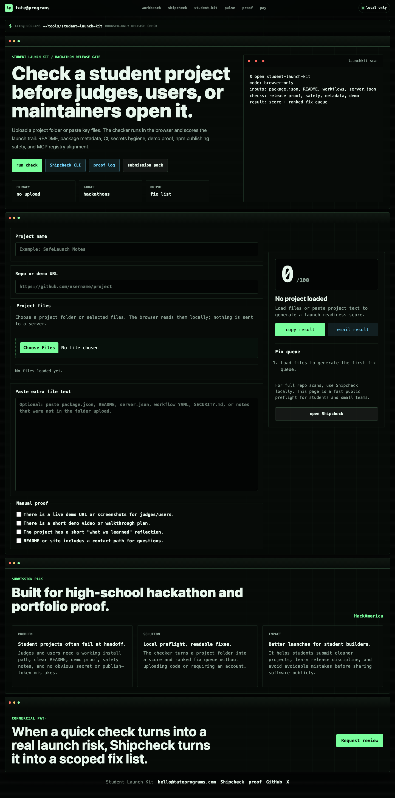

# Student Launch Kit

Browser-only launch preflight for student software projects.

Student Launch Kit reads a local project folder and returns a launch-readiness score with a ranked fix queue and downloadable Markdown report. It is built for hackathon teams, first public launches, and student portfolios where the repo needs to make sense quickly to judges, maintainers, users, or collaborators.

Live demo: <https://tateprograms.com/student-launch-kit.html>



## What It Checks

- Project identity: package metadata, README depth, license, repo/demo proof.
- Build trail: build/test scripts, CI workflow, lockfile, dependency hygiene.
- Safety basics: accidental secrets, public env naming, `.env.example`, `.gitignore`.
- Service boundaries: Stripe webhook verification, Supabase RLS hints, Firebase rules.
- Launch proof: demo URL, walkthrough video plan, reflection, contact path.
- MCP/package launch readiness: `server.json` version alignment and npm publish-token risk.
- Report export: a shareable Markdown launch report with signal scores, file evidence, and the highest-priority fixes.

## Privacy

All analysis runs in the browser with the File API. Files are not uploaded to a server. The page can be opened locally or hosted as static HTML, CSS, and JavaScript.

## Run Locally

```bash
npm install
npm run check
npm run build
npm run serve
```

Then open <http://127.0.0.1:4179>.

## HackAmerica Submission Angle

The project addresses a real-world problem for student builders: projects often work locally but fail at handoff because the README is thin, the demo is unclear, CI is missing, or launch-sensitive configuration is exposed. Student Launch Kit turns those hidden launch risks into a readable checklist before submission.

## Built With

- HTML
- CSS
- JavaScript
- Browser File API
- GitHub Actions
- GitHub Pages

## Repository Structure

```text
index.html
student-launch-kit.js
styles.css
docs/hackamerica-submission-pack.md
.github/workflows/ci.yml
```

## License

MIT
